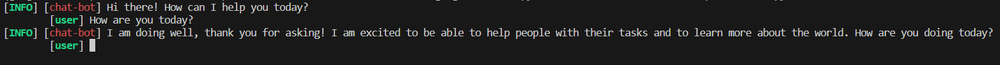

# Google Chatbot AI

# Installations
* ## Anaconda
    ```
    conda env create -f environment.yml
    conda activate google-chatbot
    ```
* ## Pip
    ```
    pip install -r requirements.txt
    ```

# API key
1. Create your own API key at https://makersuite.google.com/app/apikey
2. Copy your API key and paste to `.env` file <br>
    Your `.env` file would be
    ```
    Google-Generative-API-KEY=YOUR_API_KEY
    ```
3. `main.py` will get API key
    ```Python
    api_key = os.getenv("Google-Generative-API-KEY")
    ```
# Usage
```
python main.py 
```
Output
<div align="center">
    
</div>

# References
* [dsdanielpark/Bard-API](https://github.com/dsdanielpark/Bard-API)
* [Google Generativeai](https://developers.generativeai.google/api/python/google/generativeai)